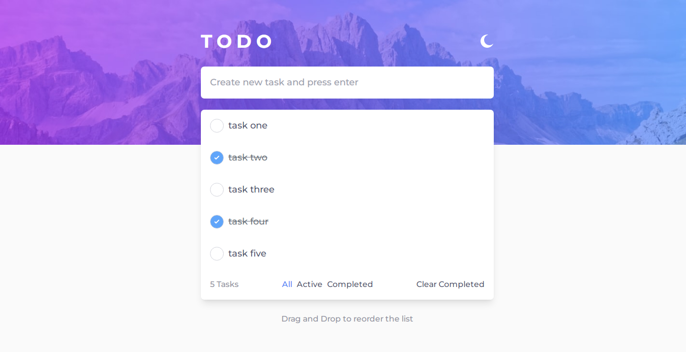

# TODO LIST APP



## How to run the project

after cloning the project go the project directory and run these commands

```
npm install
npm start
```

## app features

- Add new task to the list
- Mark a task as complete
- Delete task from the list
- Filter tasks by all/active/complete
- Clear all completed tasks
- Toggle light and dark mode
- Drag and drop to reorder tasks in the list
